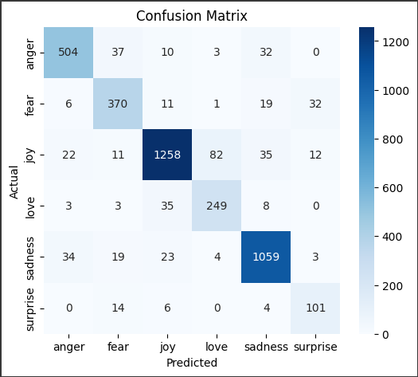

# Emotion Text Classifier {Trained By - [Divyansh Sharma](https://www.linkedin.com/in/divyansh-sharma-b4793026b/)}
Live - [Emotion-Classifier](https://emotion-classifier01.streamlit.app/)
A simple machine learning model that classifies input text into emotions like **joy**, **sadness**, **anger**, **fear**, **love**, and **surprise**.

---

## 📂 Dataset Used

This project uses the [Emotions Dataset for NLP](https://www.kaggle.com/datasets/praveengovi/emotions-dataset-for-nlp) created by **Praveen**.

- License: [CC BY 4.0](https://creativecommons.org/licenses/by/4.0/)
- The dataset contains text labeled with the following emotions:
  - **joy, sadness, anger, fear, love, surprise**

> Credits to the original author for making this dataset publicly available.

---

## ⚙️ Approach Summary

- Preprocessing with `neattext` (lowercasing, punctuation and stopword removal).
- Feature extraction using **TF-IDF Vectorizer**.
- Classification using **Support Vector Machine (SVM)** with `linear` kernel and `C=10`.
- Evaluated using accuracy and confusion matrix.
- Achieved an accuracy score of **88%**.
- Deployed using **Streamlit** with emoji-based prediction display.

---
## ✅ Performance

- **Accuracy Score**: `88.0%`
- **Evaluation Metric**: Confusion Matrix

### 📊 Confusion Matrix



---
## 📦 Dependencies

```text
pandas
scikit-learn
neattext
streamlit
joblib

You can install them using: pip install -r requirements.txt
